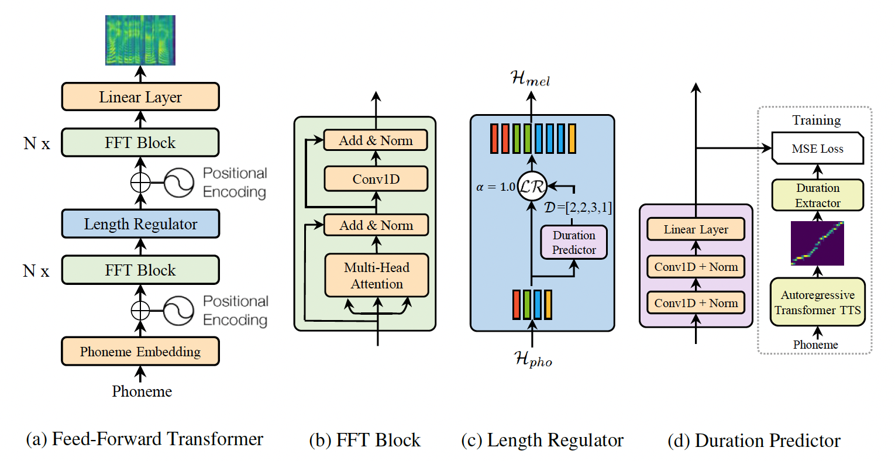

# Fastspeech

PaddlePaddle dynamic graph implementation of Fastspeech, a feed-forward network based on Transformer. The implementation is based on [FastSpeech: Fast, Robust and Controllable Text to Speech](https://arxiv.org/abs/1905.09263).

## Dataset

We experiment with the LJSpeech dataset. Download and unzip [LJSpeech](https://keithito.com/LJ-Speech-Dataset/).

```bash
wget https://data.keithito.com/data/speech/LJSpeech-1.1.tar.bz2
tar xjvf LJSpeech-1.1.tar.bz2
```

## Model Architecture



FastSpeech is a feed-forward structure based on Transformer, instead of using the encoder-attention-decoder based architecture. This model extracts attention alignments from an encoder-decoder based teacher model for phoneme duration prediction, which is used by a length
regulator to expand the source phoneme sequence to match the length of the target
mel-spectrogram sequence for parallel mel-spectrogram generation. We use the TransformerTTS as teacher model.
The model consists of encoder, decoder and length regulator three parts.

## Project Structure

```text
├── config                 # yaml configuration files
├── synthesis.py           # script to synthesize waveform from text
├── train.py               # script for model training
```

## Saving & Loading

`train_transformer.py` and `train_vocoer.py` have 3 arguments in common, `--checkpoint`, `--iteration` and `--output`.

1. `--output` is the directory for saving results.
During training, checkpoints are saved in `${output}/checkpoints` and tensorboard logs are saved in `${output}/log`.
During synthesis, results are saved in `${output}/samples` and tensorboard log is save in `${output}/log`.

2.  `--checkpoint` is the path of a checkpoint and `--iteration` is the target step. They are used to load checkpoints in the following way.

    - If `--checkpoint` is provided, the checkpoint specified by `--checkpoint` is loaded.

    - If `--checkpoint` is not provided, we try to load the checkpoint of the target step specified by `--iteration` from the `${output}/checkpoints/` directory, e.g. if given `--iteration 120000`, the checkpoint `${output}/checkpoints/step-120000.*` will be load.

    - If both `--checkpoint` and `--iteration` are not provided, we try to load the latest checkpoint from `${output}/checkpoints/` directory.

## Compute Phoneme Duration

A ground truth duration of each phoneme (number of frames in the spectrogram that correspond to that phoneme) should be provided when training a FastSpeech model.

We compute the ground truth duration of each phomemes in the following  way.
We extract the encoder-decoder attention alignment from a trained Transformer TTS model;
Each frame is considered corresponding to the phoneme that receive the most attention;

You can run alignments/get_alignments.py to get it.

```bash
cd alignments
python get_alignments.py \
--use_gpu=1 \
--output='./alignments' \
--data=${DATAPATH} \
--config=${CONFIG} \
--checkpoint_transformer=${CHECKPOINT} \
```

where `${DATAPATH}` is the path saved LJSpeech data, `${CHECKPOINT}` is the pretrain model path of TransformerTTS, `${CONFIG}` is the config yaml file of TransformerTTS checkpoint. It is necessary for you to prepare a pre-trained TranformerTTS checkpoint.

For more help on arguments

``python alignments.py --help``.

Or you can use your own phoneme duration, you just need to process the data into the following format.

```bash
{'fname1': alignment1,
'fname2': alignment2,
...}
```

## Train FastSpeech

FastSpeech model can be trained by running ``train.py``.

```bash
python train.py \
--use_gpu=1 \
--data=${DATAPATH} \
--alignments_path=${ALIGNMENTS_PATH} \
--output='./experiment' \
--config='configs/ljspeech.yaml' \
```

Or you can run the script file directly.

```bash
sh train.sh
```

If you want to train on multiple GPUs, start training in the following way.

```bash
CUDA_VISIBLE_DEVICES=0,1,2,3
python -m paddle.distributed.launch --selected_gpus=0,1,2,3 --log_dir ./mylog train.py \
--use_gpu=1 \
--data=${DATAPATH} \
--alignments_path=${ALIGNMENTS_PATH} \
--output='./experiment' \
--config='configs/ljspeech.yaml' \
```

If you wish to resume from an existing model, See [Saving-&-Loading](#Saving-&-Loading) for details of checkpoint loading.

For more help on arguments

``python train.py --help``.

## Synthesis

After training the FastSpeech, audio can be synthesized by running ``synthesis.py``.

```bash
python synthesis.py \
--use_gpu=1 \
--alpha=1.0 \
--checkpoint='./checkpoint/fastspeech/step-120000' \
--config='configs/ljspeech.yaml' \
--config_clarine='../clarinet/configs/config.yaml' \
--checkpoint_clarinet='../clarinet/checkpoint/step-500000' \
--output='./synthesis' \
```

We use Clarinet to synthesis wav, so it necessary for you to prepare a pre-trained [Clarinet checkpoint](https://paddlespeech.bj.bcebos.com/Parakeet/clarinet_ljspeech_ckpt_1.0.zip).

Or you can run the script file directly.

```bash
sh synthesis.sh
```

For more help on arguments

``python synthesis.py --help``.
