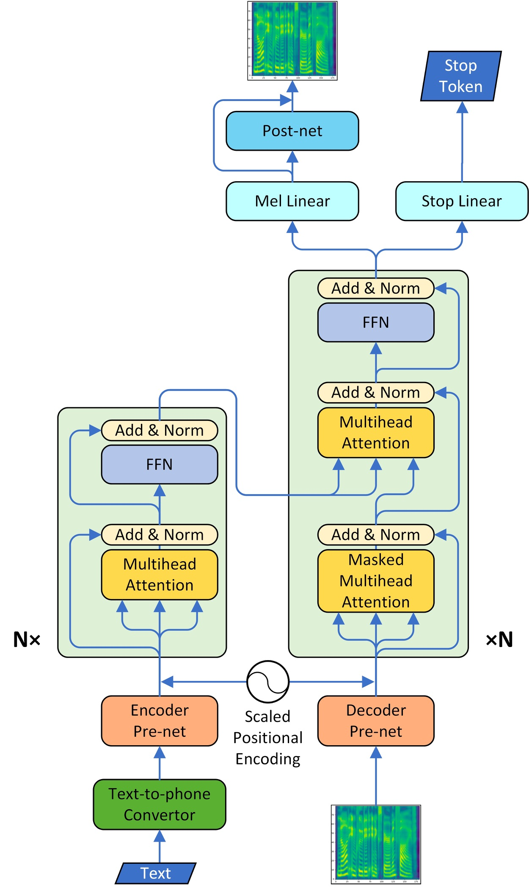

# TransformerTTS

PaddlePaddle dynamic graph implementation of TransformerTTS, a neural TTS with Transformer. The implementation is based on [Neural Speech Synthesis with Transformer Network](https://arxiv.org/abs/1809.08895).

## Dataset

We experiment with the LJSpeech dataset. Download and unzip [LJSpeech](https://keithito.com/LJ-Speech-Dataset/).

```bash
wget https://data.keithito.com/data/speech/LJSpeech-1.1.tar.bz2
tar xjvf LJSpeech-1.1.tar.bz2
```

## Model Architecture

<div align="center" name="TransformerTTS model architecture">
   <br>
</div>
<div align="center" >
TransformerTTS model architecture
</div>

The model adopts the multi-head attention mechanism to replace the RNN structures and also the original attention mechanism in [Tacotron2](https://arxiv.org/abs/1712.05884). The model consists of two main parts, encoder and decoder. We also implement the CBHG model of Tacotron as the vocoder part and convert the spectrogram into raw wave using Griffin-Lim algorithm.

## Project Structure

```text
├── config                 # yaml configuration files
├── data.py                # dataset and dataloader settings for LJSpeech
├── synthesis.py           # script to synthesize waveform from text
├── train_transformer.py   # script for transformer model training
├── train_vocoder.py       # script for vocoder model training
```

## Saving & Loading

`train_transformer.py` and `train_vocoer.py` have 3 arguments in common, `--checkpoint`, `--iteration` and `--output`.

1. `--output` is the directory for saving results.
During training, checkpoints are saved in `${output}/checkpoints` and tensorboard logs are saved in `${output}/log`.
During synthesis, results are saved in `${output}/samples` and tensorboard log is save in `${output}/log`.

2.  `--checkpoint` is the path of a checkpoint and `--iteration` is the target step. They are used to load checkpoints in the following way.

    - If `--checkpoint` is provided, the checkpoint specified by `--checkpoint` is loaded.

    - If `--checkpoint` is not provided, we try to load the checkpoint of the target step specified by `--iteration` from the `${output}/checkpoints/` directory, e.g. if given `--iteration 120000`, the checkpoint `${output}/checkpoints/step-120000.*` will be load.

    - If both `--checkpoint` and `--iteration` are not provided, we try to load the latest checkpoint from `${output}/checkpoints/` directory.

## Train Transformer

TransformerTTS model can be trained by running ``train_transformer.py``.

```bash
python train_trasformer.py \
--use_gpu=1 \
--data=${DATAPATH} \
--output='./experiment' \
--config='configs/ljspeech.yaml' \
```

Or you can run the script file directly.

```bash
sh train_transformer.sh
```

If you want to train on multiple GPUs, you must start training in the following way.

```bash
CUDA_VISIBLE_DEVICES=0,1,2,3
python -m paddle.distributed.launch --selected_gpus=0,1,2,3 --log_dir ./mylog train_transformer.py \
--use_gpu=1 \
--data=${DATAPATH} \
--output='./experiment' \
--config='configs/ljspeech.yaml' \
```

If you wish to resume from an existing model, See [Saving-&-Loading](#Saving-&-Loading) for details of checkpoint loading.

**Note: In order to ensure the training effect, we recommend using multi-GPU training to enlarge the batch size, and at least 16 samples in single batch per GPU.**

For more help on arguments

``python train_transformer.py --help``.

## Train Vocoder

Vocoder model can be trained by running ``train_vocoder.py``.

```bash
python train_vocoder.py \
--use_gpu=1 \
--data=${DATAPATH} \
--output='./vocoder' \
--config='configs/ljspeech.yaml' \
```

Or you can run the script file directly.

```bash
sh train_vocoder.sh
```

If you want to train on multiple GPUs, you must start training in the following way.

```bash
CUDA_VISIBLE_DEVICES=0,1,2,3
python -m paddle.distributed.launch --selected_gpus=0,1,2,3 --log_dir ./mylog train_vocoder.py \
--use_gpu=1 \
--data=${DATAPATH} \
--output='./vocoder' \
--config='configs/ljspeech.yaml' \
```

If you wish to resume from an existing model, See [Saving-&-Loading](#Saving-&-Loading) for details of checkpoint loading.

For more help on arguments

``python train_vocoder.py --help``.

## Synthesis

After training the TransformerTTS and vocoder model, audio can be synthesized by running ``synthesis.py``.

```bash
python synthesis.py \
--max_len=300 \
--use_gpu=1 \
--output='./synthesis' \
--config='configs/ljspeech.yaml' \
--checkpoint_transformer='./checkpoint/transformer/step-120000' \
--checkpoint_vocoder='./checkpoint/vocoder/step-100000' \
```

Or you can run the script file directly.

```bash
sh synthesis.sh
```

For more help on arguments

``python synthesis.py --help``.
